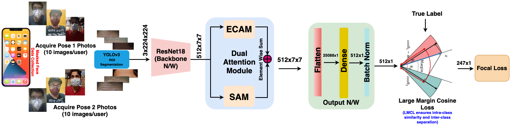

# Mobile based Human Identification using Forehead Creases: Application and Assessment under COVID-19 Masked Face Scenarios

This repository contains the code implementation for our paper, which was accepted at **[WACV 2022](https://wacv2022.thecvf.com)** conference.

## Table of Contents
- [License](#license)
- [Abstract](#abstract)

## Abstract
In the COVID-19 situation, face masks have become an essential part of our daily life. As mask occludes most prominent facial characteristics, it brings new challenges to the existing facial recognition systems. This paper presents an idea to consider forehead creases (under surprise facial expression) as a new biometric modality to authenticate mask-wearing faces. The forehead biometrics utilizes the creases and textural skin patterns appearing due to voluntary contraction of the forehead region as features. The proposed framework is an efficient and generalizable deep learning framework for forehead recognition. Face-selfie images are collected using smartphone's frontal camera in an unconstrained environment with various indoor/outdoor realistic environments. Acquired forehead images are first subjected to a segmentation model that results in rectangular Region Of Interest (ROI's). A set of convolutional feature maps are subsequently obtained using a backbone network. The primary embeddings are enriched using a dual attention network (DANet) to induce discriminative feature learning. The attention-empowered embeddings are then optimized using Large Margin Cosine Loss (LMCL) followed by Focal Loss to update weights for inducting robust training and better feature discriminating capabilities. Our system is end-to-end and few-shot; thus, it is very efficient in memory requirements and recognition rate. Besides, we present a forehead image dataset ([BITS-IITMandi-ForeheadWrinkle Images Database](http://ktiwari.in/projects/foreheadwrinkle/)) that has been recorded in two sessions from **247 subjects** containing a total of **4,964** selfie-face mask images. To the best of our knowledge, this is the first to date mobile-based forehead dataset and is being made available along with the mobile application in the public domain. The proposed system has achieved high performance results in both closed-set, i.e., CRR of 99.08% and EER of 0.44% and open-set matching, i.e., CRR: 97.84%, EER: 12.40% which justifies the significance of using forehead as a biometric modality.
